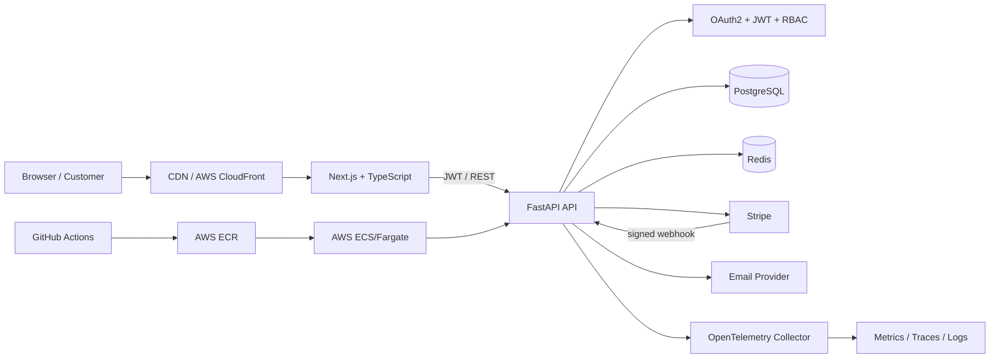
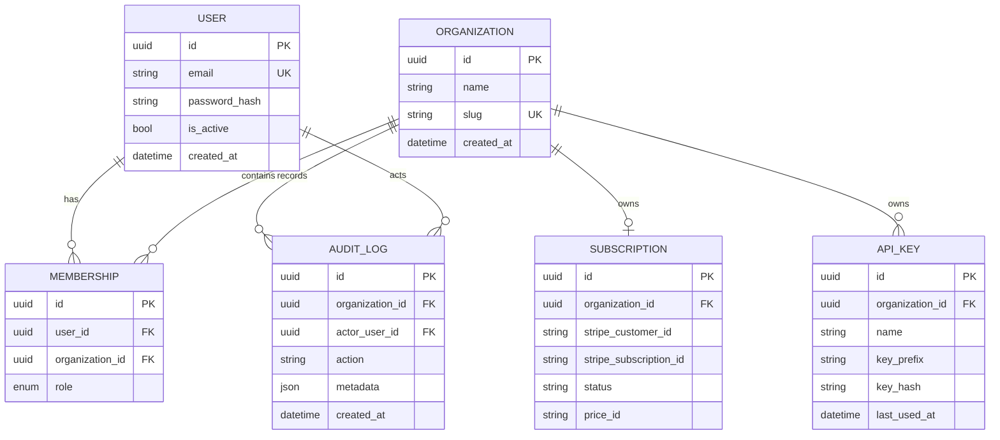

# Atlas SaaS — Production-Grade Multi-Tenant Platform

[](https://github.com/YOUR_USERNAME/atlas-saas/actions/workflows/ci.yml)
[](LICENSE)
[](https://www.python.org/)
[](https://nextjs.org/)

A portfolio-grade B2B SaaS reference implementation designed to demonstrate production software engineering: **multi-tenancy, JWT authentication, RBAC, Stripe billing, API keys, audit logs, Redis-backed rate limiting, webhooks, background email, observability, automated tests, Docker, and CI/CD**.

> **Live demo:** `https://YOUR_DOMAIN` *(replace after deployment)*  
> **API docs:** `https://YOUR_API_DOMAIN/docs` *(FastAPI OpenAPI/Swagger)*  
> **Status:** `https://YOUR_STATUS_PAGE` *(optional)*

## Why this project stands out

This repository deliberately goes beyond CRUD. It models the concerns engineers face in real SaaS systems: tenant isolation, authorization boundaries, idempotent billing webhooks, hashed API keys, auditability, rate limits, health probes, structured telemetry, migrations, integration tests, and reproducible local infrastructure.

## Architecture



### Request flow
1. A user signs in and receives short-lived JWT credentials.
2. Every protected request resolves the active organization and role.
3. RBAC checks enforce `owner`, `admin`, `member`, and `viewer` permissions.
4. PostgreSQL persists durable business state; Redis handles rate-limit counters and cache-ready ephemeral data.
5. Stripe webhook events are signature-verified and idempotently processed.
6. Sensitive actions generate immutable audit-log entries.
7. OpenTelemetry instruments the API for distributed traces and metrics.

## Screenshots / demo

Add real screenshots after deployment so recruiters can verify the running product rather than seeing mockups.

| Screen | File to replace |
|---|---|
| Dashboard | `docs/screenshots/dashboard.png` |
| Team / RBAC | `docs/screenshots/team.png` |
| Billing | `docs/screenshots/billing.png` |
| API keys | `docs/screenshots/api-keys.png` |

Optional: record a 30–60 second walkthrough and save it as `docs/demo.gif`.

## Technology stack

| Layer | Technology | Purpose |
|---|---|---|
| Frontend | Next.js, React, TypeScript | SSR-capable web application and dashboard |
| Backend | FastAPI, Python | Typed REST API + generated OpenAPI docs |
| Data | PostgreSQL, SQLAlchemy, Alembic | Durable relational storage and migrations |
| Cache | Redis | Distributed rate limiting / cache foundation |
| Auth | OAuth2 password flow, JWT, RBAC | Authentication and authorization |
| Billing | Stripe | Checkout, subscriptions, signed webhooks |
| Testing | PyTest, Playwright | API/unit and browser E2E tests |
| Observability | OpenTelemetry | Traces and instrumentation |
| Infrastructure | Docker, Docker Compose, AWS | Reproducible local + cloud deployment |
| Delivery | GitHub Actions | CI and deployment pipeline |

## Core capabilities

- Multi-tenant organizations and team membership
- Registration/login with Argon2 password hashing and JWT
- Organization-scoped RBAC
- Stripe Checkout + Customer Portal + webhook endpoint
- API key issuance with **only hashes stored server-side**
- Audit log for security-sensitive operations
- Redis-backed fixed-window rate limiting with safe local fallback
- Email notification abstraction (console in development; provider-ready)
- Health/readiness endpoints
- OpenTelemetry FastAPI instrumentation
- Docker Compose development environment
- Alembic database migrations
- PyTest backend tests + Playwright E2E smoke test
- CI workflow for backend, frontend, and E2E validation
- AWS ECS/Fargate deployment blueprint

## Database schema



## API documentation

When the backend is running:

- Swagger UI: `http://localhost:8000/docs`
- ReDoc: `http://localhost:8000/redoc`
- OpenAPI JSON: `http://localhost:8000/openapi.json`

Representative endpoints:

| Method | Endpoint | Description |
|---|---|---|
| `POST` | `/api/v1/auth/register` | Create user + first organization |
| `POST` | `/api/v1/auth/token` | OAuth2-compatible login |
| `GET` | `/api/v1/users/me` | Current user profile |
| `GET/POST` | `/api/v1/organizations` | List/create organizations |
| `GET/POST` | `/api/v1/organizations/{id}/members` | Team membership management |
| `POST` | `/api/v1/billing/checkout` | Stripe subscription checkout |
| `POST` | `/api/v1/billing/portal` | Stripe customer portal |
| `POST` | `/api/v1/webhooks/stripe` | Signed Stripe webhook receiver |
| `GET/POST` | `/api/v1/api-keys` | Manage organization API keys |
| `GET` | `/api/v1/audit-logs` | Admin/owner audit history |
| `GET` | `/health` | Liveness |
| `GET` | `/ready` | DB readiness |

## Local installation

### Prerequisites
- Docker + Docker Compose
- Node.js 20+ (for running frontend outside Docker)
- Python 3.12+ (for running API outside Docker)

### Fastest path: Docker

```bash
cp .env.example .env
docker compose up --build
```

Then open:
- Web app: `http://localhost:3000`
- API docs: `http://localhost:8000/docs`
- API health: `http://localhost:8000/health`

### Database migration

```bash
docker compose exec api alembic upgrade head
```

### Seed demo account

```bash
docker compose exec api python -m app.seed
```

Demo credentials in local development only:
`demo@example.com` / `DemoPassword123!`

## Development without Docker

Backend:

```bash
cd backend
python -m venv .venv
source .venv/bin/activate  # Windows: .venv\\Scripts\\activate
pip install -e '.[dev]'
cp ../.env.example ../.env
uvicorn app.main:app --reload --port 8000
```

Frontend:

```bash
cd frontend
npm ci
NEXT_PUBLIC_API_URL=http://localhost:8000 npm run dev
```

## Tests

```bash
# Backend
cd backend && pytest -q --cov=app

# Frontend type/lint/build
cd frontend && npm run lint && npm run build

# E2E (services must be running)
cd frontend && npx playwright test
```

Testing strategy separates fast unit/API tests from browser-level smoke tests. CI runs on every pull request.

## Docker setup

`docker-compose.yml` starts four services:
- `web`: Next.js production build
- `api`: FastAPI/Uvicorn
- `db`: PostgreSQL 16
- `redis`: Redis 7

Containers include health checks and the API waits for durable dependencies before serving traffic.

## CI/CD

`.github/workflows/ci.yml` performs:
1. Python dependency install, lint, and PyTest.
2. Node dependency install, lint, and production build.
3. Docker Compose integration startup and Playwright smoke test.
4. On `main`, an optional deployment job can authenticate to AWS via GitHub OIDC, build images, push to ECR, and update ECS services.

The deployment example intentionally uses **OIDC instead of long-lived AWS access keys**.

## AWS deployment blueprint

Recommended production topology:
- Route 53 → CloudFront → Next.js web service
- Application Load Balancer → ECS/Fargate FastAPI tasks
- RDS PostgreSQL Multi-AZ
- ElastiCache Redis
- ECR for container images
- Secrets Manager / SSM Parameter Store
- CloudWatch + OpenTelemetry collector/exporter
- AWS WAF at the public edge

See [`infra/README.md`](infra/README.md) for deployment steps and production hardening.

## Design decisions

**FastAPI over a monolithic full-stack framework.** It exposes clear service boundaries, excellent type-driven OpenAPI output, async-friendly I/O, and a Python ecosystem useful for future data/AI workloads.

**PostgreSQL as source of truth.** Organization membership, subscriptions, API keys, and audit events are relational and benefit from constraints and transactions.

**Tenant ID in every tenant-owned table.** Application-level authorization always scopes reads/writes to an organization. At larger scale, add PostgreSQL Row Level Security as defense in depth.

**Opaque API keys.** Raw keys are returned once; only SHA-256 hashes and short prefixes are stored.

**Webhook idempotency.** Stripe event IDs are persisted before business side effects, preventing duplicate delivery from applying an event twice.

**Redis is non-authoritative.** Losing cache/rate-limit state must not corrupt business data.

## Security considerations

- Passwords hashed with Argon2; never logged.
- Short-lived signed JWTs; rotate signing secrets in production.
- Organization ID is never trusted without membership verification.
- RBAC enforced server-side, not only hidden in UI.
- API keys are high-entropy and stored hashed.
- Stripe webhook signatures are verified.
- SQLAlchemy parameterization prevents raw SQL interpolation in application paths.
- CORS allowlist is environment-configured.
- Rate limiting protects high-risk endpoints; production should add WAF/gateway limits too.
- Secrets belong in AWS Secrets Manager/SSM, never Git.
- Production cookies/tokens should use HTTPS only; consider a BFF + secure HttpOnly refresh-cookie pattern for higher assurance.
- CI should add dependency scanning, secret scanning, SAST, container scanning, and SBOM generation before regulated production use.

See [`SECURITY.md`](SECURITY.md) for reporting and hardening notes.

## Performance benchmarks

Do **not** claim portfolio metrics until measured on the deployed environment. A k6 script is included at `benchmarks/load.js`.

Run:

```bash
k6 run -e BASE_URL=http://localhost:8000 benchmarks/load.js
```

Publish measured results here after deployment:

| Metric | Current measured value | Target / SLO |
|---|---:|---:|
| Registered users | TBD after deployment | — |
| Sustained RPS | TBD via k6 | 500+ per API service tier |
| p50 latency | TBD | < 100 ms |
| p95 latency | TBD | < 300 ms |
| Error rate | TBD | < 0.1% |
| Uptime | TBD from monitor | 99.9% |

This distinction matters: **targets are engineering objectives; measured values are evidence**.

## Scaling to 1M users

A million registered users is primarily a data, traffic-shaping, and operational problem—not a reason to prematurely split every module into microservices.

1. **Stateless API horizontal scaling:** run multiple FastAPI tasks behind an ALB; keep sessions/tokens stateless and ephemeral coordination in Redis.
2. **Database:** use RDS Multi-AZ, connection pooling (PgBouncer/RDS Proxy), proper composite indexes, read replicas for read-heavy workloads, and partition high-volume audit/event tables.
3. **Tenant strategy:** begin shared-schema with indexed `organization_id`; introduce RLS. For very large tenants, graduate to tenant sharding/dedicated databases based on observed hotspots.
4. **Caching:** cache expensive read models and configuration in Redis with explicit TTL/invalidation; never make Redis the billing source of truth.
5. **Async workloads:** move email, webhook fan-out, exports, and analytics to SQS + workers; use DLQs and idempotency keys.
6. **Static/edge:** serve assets through CloudFront; use CDN caching for public content.
7. **Billing/webhooks:** acknowledge verified events quickly, enqueue processing, persist event IDs, retry safely.
8. **Observability:** trace cross-service calls, define SLOs/error budgets, alert on saturation/error/latency rather than raw CPU alone.
9. **Security:** WAF, bot protection, per-tenant quotas, key rotation, least-privilege IAM, centralized secrets, audit retention, automated vulnerability management.
10. **Evolution:** extract services only where independent scaling, ownership, or failure isolation produces measurable value (e.g., notifications, billing, analytics).

## Repository layout

```text
.
├── backend/                 # FastAPI application, models, migrations, tests
├── frontend/                # Next.js/TypeScript dashboard + Playwright
├── benchmarks/              # k6 load test
├── docs/                    # Architecture and screenshot placeholders
├── infra/                   # AWS deployment blueprint
├── .github/workflows/       # CI/CD
├── docker-compose.yml
├── .env.example
├── SECURITY.md
└── README.md
```

## Recruiter walkthrough

A recruiter should be able to follow this path:

**Resume → GitHub repository → architecture/README → live demo → API docs → CI tests → measured benchmarks.**

Before placing this on a resume, replace all `YOUR_*` placeholders, deploy it, add real screenshots, run the benchmark, and publish only verifiable metrics.

## License
MIT — see [`LICENSE`](LICENSE).
